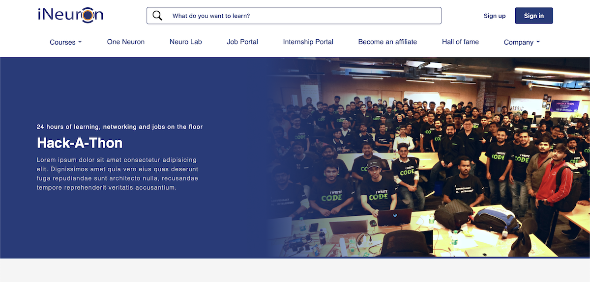
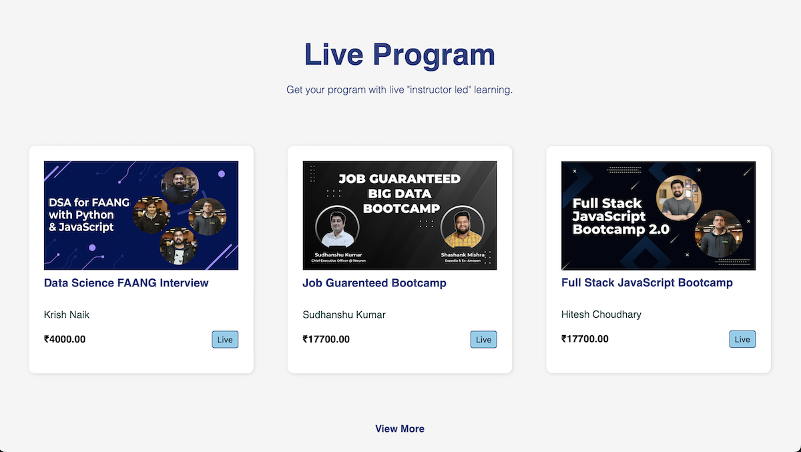

# **iNeuron Landing Design**
This is a clone project of iNeuron.ai landing page designed and created using HTML and CSS only.
 
 

## **Features :**
- To align different element box CSS Grid property is used.
- Dummy text and images is used in some places just for reference.
- This landing page is a static replica of the ineuron.ai home page, and doesn't have any animation - no JavaScript included.

 

## **Screenshots**

 

 

## **Deployed Link :**

 